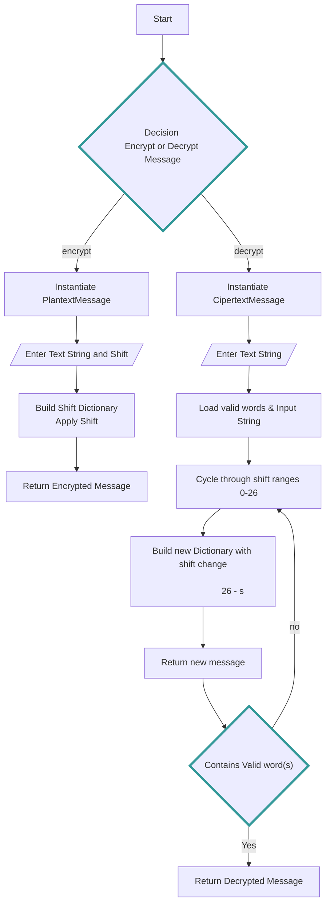

---
tags:
  - college
---

---
# Week 1 Stuff


# Problem Set 1
The ceaser shift

### Helper Functions
`def load_words()` 

`def is_word()`

---

def get_story_string

----
# Classes

## Base Class
**Message** 
- `get_message_text`
- `get_valid_words`
- `build_shift_dict`
- `apply_shift`

### Derived Class (Message)
**PlainTextMessage** - Encryptes Message
- `get_shift`
- `get_encrypted_dict`
- `get_message_text_encrypted`
- `change shift`

### Derived Class (Message)
**CiperTextMessage** - Decryptes Message
- `decrypt_message`
- 


```Python
if __name__ == "__main__":
    #Example test case (PlaintextMessage)
    plaintext = PlaintextMessage('hello', 2)
    print('Expected Output: jgnnq')
    print('Actual Output:', plaintext.get_message_text_encrypted())
        
    #Example test case (CiphertextMessage)
    ciphertext = CiphertextMessage('jgnnq')
    print('Expected Output:', (24, 'hello'))
    print('Actual Output:', ciphertext.decrypt_message())

    #Example test case (CiphertextMessage)
    ciphertext = CiphertextMessage(get_story_string())
    print('Actual Output:', ciphertext.decrypt_message())
```




## Write up
Problem set number one dealt with creating classes that handled decrypting and encrypting messages based on "The Ceaser Cipher." Having limited experience writing classes I found this assignment challenging.

The purpose of the code is to setup a class that handles encryption and another class that handles decrypting a message or string. Each class is derived from a Message class that handles loading a list of valid words and building a dictionary of letters whose values are the corresponding letters in the shifted alpahbet for the Ceaser Cipher. 

The PlaintextMessage object handles encrypting a message using a string and value to build a dictionary and return a string. The PlaintextMessage object contains an important method for changing the shift values. The CiphertextMessage relies on this method to update the attributes return a message based on the shifted dictionary.

The CiphertextMessage object handles decrypting a string using the decrypt_message method. The method loads a list of valid words and loops through a range of shifts that the PlaintextMessage change_shift methods uses to return a new string. This string gets test against the list of valid words. If it's a single word and a match is found the method will return the accepted string and shift value

If a large string is used as an input for decryption. The decrypt_message method will split the string based on spaces compare each word in the split against the valid_word list. If a match is found the count is increased. If at the end of the string the valid word count is higher than the max_validword of 10 words then the loop is terminated and the best string and shift are returned.

I found this assignmet challening trying to understand the assignment and parsing the code for deliberate errors. I found understanding the super method and it's purpose challenging. Once I worked with some smaller examples I began to understand the purpose and could start fitting the pieces togther. Will I understand creating a application with objects is more modular and reusable I can help but feel using functions would have completed the same task with a lot less code.